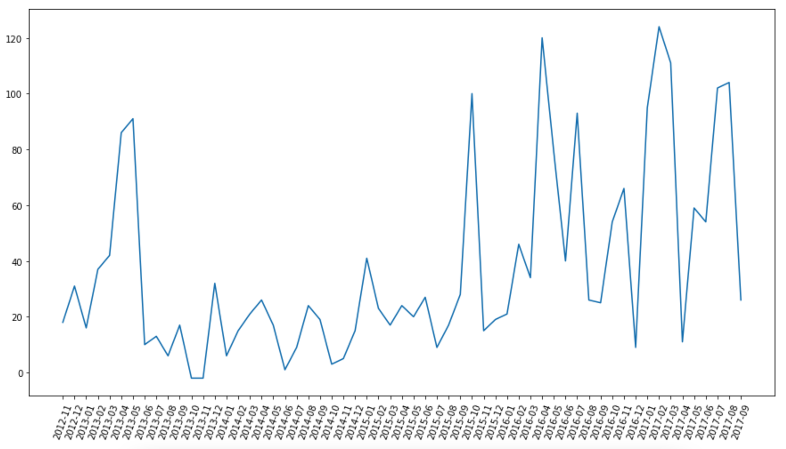
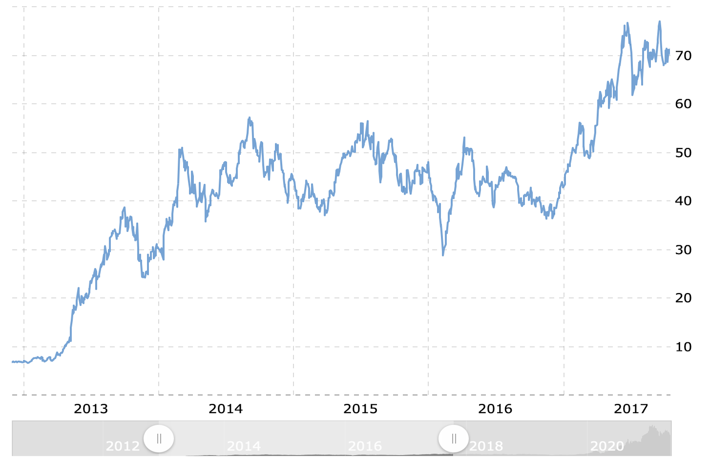
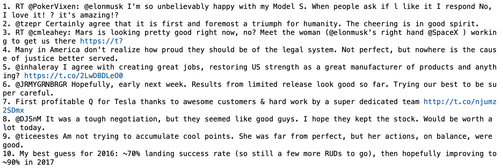

# Анализ тональности текста на данных Твиттера

## Цели:
- Научиться проводить анализ тональности текста при помощи Питона
- Проанализировать тональность твитов Илона Маска 

## План: 
- Найти датасет для определения валентности английских слов
- Найти простой тестовый датасет с твитами
- Найти датасет с твитами Илона Маска
- Написать препроцессинг текста:
  - Токенизация
  - Лемматизация
  - Стоп-слова и пунктуация
- Проанализировать тестовый датасет, составить топ 10 самых позитивных твитов, пользователей и геолокаций
- Проанализировать твиты Илона Маска с 2012 по 2017, составить топ 10 самых позитивных и топ 10 самых негативных твитов
- Получить "позитивность" на каждый месяц при помощи группировки и проверить, как график позитивности коррелирует со стоимостью акций Тесла

## Заключение:
- Написана система для анализа тональности твитов
- Определены Топ 10 самых позитивных и самых негативных твитов Илона Маска
- Позитивность твитов Илона Маска частично коррелирует со стоимостью акций Теста

## Библиотеки:
nltk, numpy, pandas, matplotlib

## Становится ли позитивнее Твитер Илона Маска от роста котировок акций Тесла?
### Тренд роста позитивности твитов и котировки акции Тесла в этот же период

 

 

## Топ 10 самых позитивных твитов Илона Маска

 

